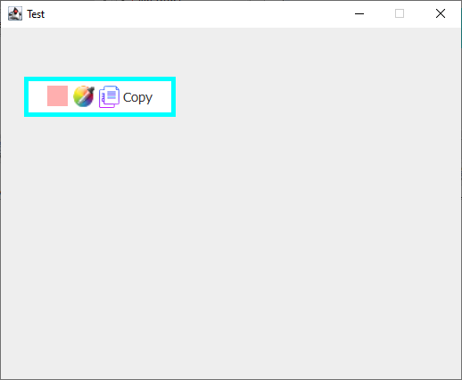
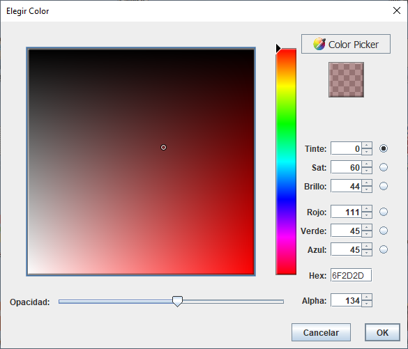
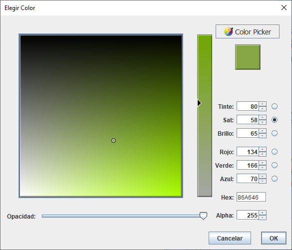
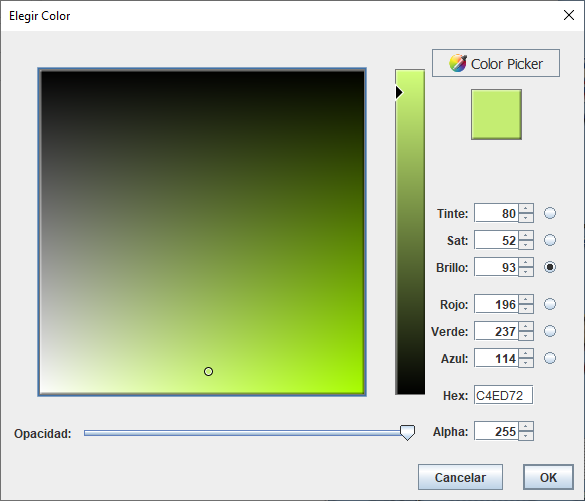
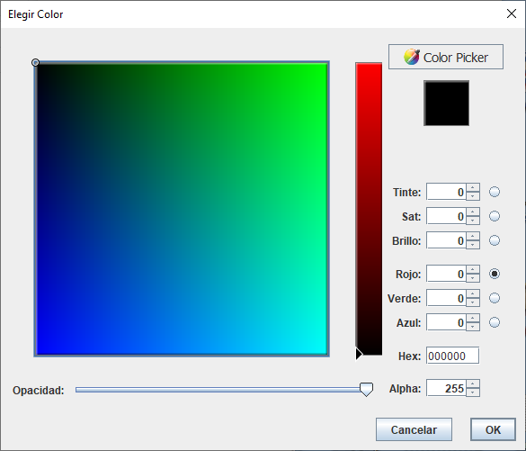
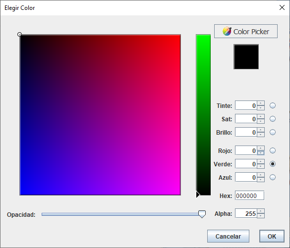
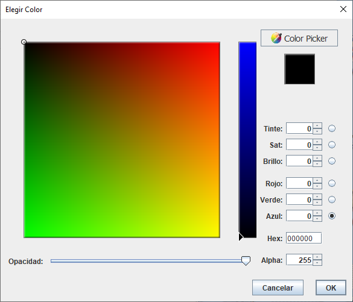

# LibColourPickerWithDesktopColorSelector

- pom.xml

~~~java

    <dependencies>
    		
		<dependency>
			
			<groupId>com.1stleg</groupId>
			
			<artifactId>jnativehook</artifactId>
			
			<version>2.1.0</version>
    
		</dependency>
    
	</dependencies>
		
~~~

- Class.java

~~~java

		CopyColor panel = new CopyColor(true);
		
		/*	true --> If the transparency is activated,

			the format of the html color code is changed 
			
			with the alpha (transparency).

			If false, this option is disabled.
		*/
		
~~~

- Example (Main.java)

~~~java

import java.awt.Dimension;

import java.awt.event.ActionEvent;

import java.io.IOException;

import javax.swing.GroupLayout;

import javax.swing.GroupLayout.Alignment;

import javax.swing.JFrame;

import javax.swing.event.ChangeEvent;

import net.java.dev.colorchooser.demo.CopyColor;

@SuppressWarnings("all")

public class Main extends javax.swing.JFrame {

	public Main() throws IOException {

		setTitle("Test");

		setType(Type.UTILITY);

		initComponents();

		this.setVisible(true);

	}

	public static void main(String[] args) {

		try {

			new Main().setVisible(true);

		}

		catch (Exception e) {
			e.printStackTrace();
		}

	}

	public void initComponents() throws IOException {

		setDefaultCloseOperation(JFrame.DISPOSE_ON_CLOSE);

		setCursor(new java.awt.Cursor(java.awt.Cursor.DEFAULT_CURSOR));

		setResizable(false);

		CopyColor panel = new CopyColor(true);

		javax.swing.GroupLayout layout = new javax.swing.GroupLayout(getContentPane());

		layout.setHorizontalGroup(layout.createParallelGroup(Alignment.LEADING)
				.addGroup(layout
						.createSequentialGroup().addComponent(panel, GroupLayout.PREFERRED_SIZE,
								GroupLayout.DEFAULT_SIZE, GroupLayout.PREFERRED_SIZE)
						.addContainerGap(323, Short.MAX_VALUE)));

		layout.setVerticalGroup(layout.createParallelGroup(Alignment.LEADING)
				.addGroup(layout
						.createSequentialGroup().addComponent(panel, GroupLayout.PREFERRED_SIZE,
								GroupLayout.DEFAULT_SIZE, GroupLayout.PREFERRED_SIZE)
						.addContainerGap(329, Short.MAX_VALUE)));

		getContentPane().setLayout(layout);

		setSize(new Dimension(532, 433));

		setLocationRelativeTo(null);

	}

	public void actionPerformed(ActionEvent arg0) {

	}

	public void stateChanged(ChangeEvent e) {

	}

}

~~~